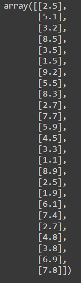
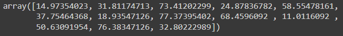
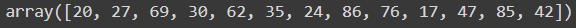
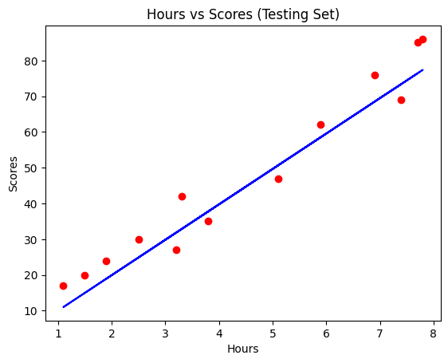
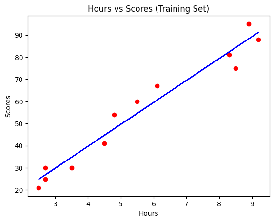
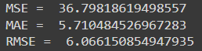

# Implementation-of-Simple-Linear-Regression-Model-for-Predicting-the-Marks-Scored

## AIM:
To write a program to predict the marks scored by a student using the simple linear regression model.

## Equipments Required:
1. Hardware – PCs
2. Anaconda – Python 3.7 Installation / Jupyter notebook

## Algorithm
1. 
2. 
3. 
4. 

## Program:

/*
Program to implement the simple linear regression model for predicting the marks scored.
Developed by: S.Kailash Kumar
RegisterNumber: 212223220041 
*/
```py
import pandas as pd
import numpy as np
import matplotlib.pyplot as plt
#import libraries to find mae, mse
from sklearn.metrics import mean_absolute_error
from sklearn.metrics import mean_squared_error
#read csv file
df= pd.read_csv('data.csv')
#displaying the content in datafile
df.head()
df.tail()
# Segregating data to variables
X=df.iloc[:,:-1].values
X
y=df.iloc[:,-1].values
y
#splitting train and test data
from sklearn.model_selection import train_test_split
X_train,X_test,y_train,y_test=train_test_split(X,y,test_size=1/2,random_state=0)
#import linear regression model and fit the model with the data
from sklearn.linear_model import LinearRegression
regressor=LinearRegression()
regressor.fit(X_train,y_train)
#displaying predicted values
y_pred=regressor.predict(X_test)
y_pred
#displaying actual values
y_test
#graph plot for training data
import matplotlib.pyplot as plt
plt.scatter(X_train,y_train,color='red')
plt.plot(X_train,regressor.predict(X_train),color='blue')
plt.title("Hours vs Scores (Training Set)")
plt.xlabel("Hours")
plt.ylabel("Scores")
#graph plot for test data
plt.scatter(X_test,y_test,color='red')
plt.plot(X_test,regressor.predict(X_test),color='blue')
plt.title("Hours vs Scores (Testing Set)")
plt.xlabel("Hours")
plt.ylabel("Scores")
#find mae,mse,rmse
mse=mean_squared_error(y_test,y_pred)
print('MSE = ',mse)
mae=mean_absolute_error(y_test,y_pred)
print('MAE = ',mae)
rmse=np.sqrt(mse)
print('RMSE = ',rmse)
```

## Output:
### HEAD VALUE

### TAIL VALUE

### X value

### Y value

### Predictd Value

### Actual value

### Training Set


### MSE, MAE and RMSE

## Result:
Thus the program to implement the simple linear regression model for predicting the marks scored is written and verified using python programming.
